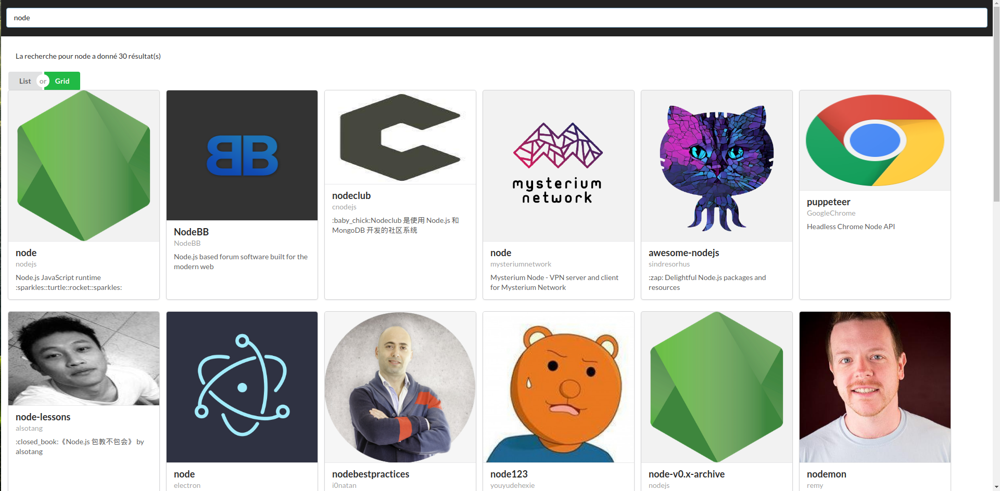

# Challenge Github API

Aujourd'hui, on se fait plaisir et on met enpratique tout ce qu'on a vu pour se créer une application qui fonctionne avec une véritable API, celle de github !

**Objectif**

Faire un annuaire qui permette de chercher des repos sur github

Github fourni une API qui permet de chercher dans tous les repos, à cette adresse:

***

https://api.github.com/search/repositories?q=REPOACHERCHER

***

En remplçant REPOACHERCHER par ce qui a été saisi par l'utilisateur, vous obtiendrez une liste de resultats.

### Astuces

Pour gagner du temps sur la mise en forme, nous allons utiliser une bibliothèque: Semantic-UI

https://react.semantic-ui.com/

Pour l'installation vous trouverez les instructions ici:

https://react.semantic-ui.com/usage

### Composants REACT à créer

* Search Bar

* ReposResults (pour afficher les repos correspondant à la recherche)

* ErrorMessage (pour afficher les erreus avec l'API)

### Composant Semantic à utliser

* Message (pour ErrorMessage)

* Card.Group (Pour ReposResults)

* Icon et Image, eventuellement

### Comportement

Lorsque je submit le formulaire de recherche en appuyant sur entrer, une requête est faite pour récupérer les résultats. En cas de resultats, ils s'affichent sous la barre de recherche, sous forme de cartes, comme sur l'image.

> # ATTENTION !
> Si vous arrivez à afficher sous forme de cartes les résultats fournis par github, c'est vraiment énormé !!
> Les bonus, c'est uniquement si vous êtes très très très gourmands...

### Conseils méthodologiques

* Je fais déjà l'affichage avec des composants statiques (sans props)
  * la search bar
  * le message d'erreur
  * la liste de cartes
* Je donne des props (et vérifie les prop-types) avec des données que je crée moi même, pour tester
* Je transforme mon composant racine en class, pour utiliser le state
* Je mets mes fausses données dans le state, et je les passe aux composants
* Je crée une méthode pour gérer le changement dans l'input de recherche
* Je crée une méthode pour gérer le submit
* J'essaie d'utiliser axios pour obtenir des résultats
* J'utilise axios pour obtenir des résutlats liée à la recherche de l'user (text de l'input)
* J'utilise les résultats pour donner à mon state les datas, formattées au besoin pour coller aux props attendus

### BONUS

#### 1 - On veut en savoir plus sur un repo !

Pour chaque resultat dans la recherche de repos, l'API vous renverra, notamment, une adresse qui correspond aux infos du repo sur l'API.

En récuperant cette adresse et en rajoutant /contents à la fin, vous pourrez obtenir le contenu de ce repo.

Au clic sur un resultat de recherche, je veux pouvoir voir la liste des dossiers et fichiers contenus dans ce repo.

Un composant supplémentaire à créer pour la liste des fichiers / dossiers d'un repo:

* ReposList (Pour afficher les dossiers /fichiers contenus dans un repo)

Un conseil pour le composant Semantic à utiliser:

* Table (Pour ReposList)

#### 2 - On pourrait pas choisir la présenation des résultats de recherche ?

Vous pouvez également essayer d'intégrer deux boutons, pour afficher la liste des resultats sous forme de Grid, ou de List. (voir le petit bouton sous l'input, dans l'image).

#### 3 - Un peu de nettoyage...

C'est un petit peu le bazrd dans nos fichiers ReposResults... Et si on essayait de mettre un peu d'ordre ! Séparez tous les composants de ce fichier dans des fichiers séparés, et importez les :)

#### 4 - Mais qu'est ce que c'est vide !

On s'ennuie un peu quand on arrive sur notre site... non ? Ça serait chouette que lorsque nos visiteurs chargent la page pour la première fois, il y ai déjà une liste de résultats. On pourrait pour faire ça faire en sorte que notre input soit déjà rempli avec un mot à rechercher, et dés que notre application est affichée, lancer automatiquement la méthode de recherche.

petite astuce, pour faire, le lifecycle componentDidMount peut être un bon point de départ...

#### 5 - Du nettoyage, encore ? (mécréant va)

le render de notre App.js commence à me donner la migraine, toutes ces accolades JSX et ces conditions, pfff. Et si on se faisait une méthode, chooseView par exemple, pour l'appeler dans notre render. On pourrait se débarasser de toutes ces vérifications pour les déplacer dans le chooseView !

#### 6 - Un tableau bien ordonné

Encore un petit problème d'UX... Après avoir lancé une recherche de repos et cliqué sur l'un d'eux, on arrive bien sur le tableau de contenu. Mais tout est si disparate... Ça serait vraiment top que notre tableau soit trié, avec en haut les dossiers, et en bas les fichiers !

#### 7 - Pas de retour possible, really ?!

Toujours sur ce tableau, et toujours dans la catégorie UX, je vois bien encore un petit truc à améliorer... Et si je veux revenir à ma liste de résultats, je fais comment !? je suis obligé de retourner dans mon input et de relancer la meme recherche, alors que tout est déjà présent dans le state... Essayez d'ajouter un bouton retour, au dessus du tableau, qui permette de retourner à la vue des résultats :)

#### 8 - Bon...

Ça suffit maintenant, c'est Noel quoi ! Bon ok c'est pas Noel, mais ça suffit quand même, c'est le weekend ! 
